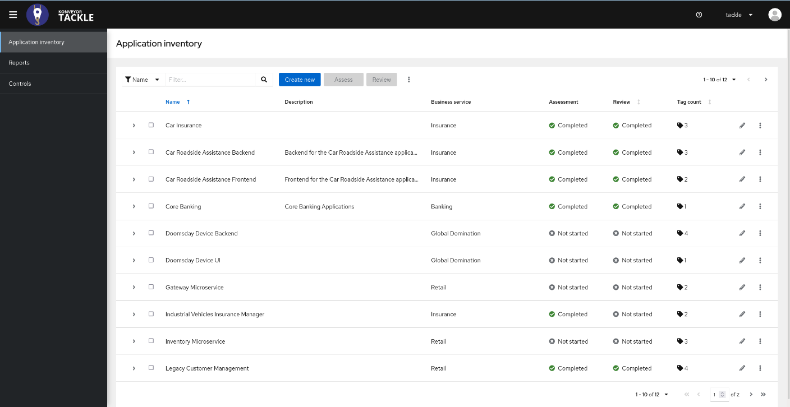
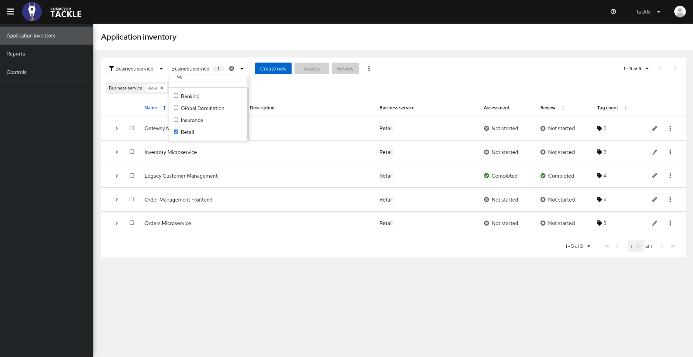
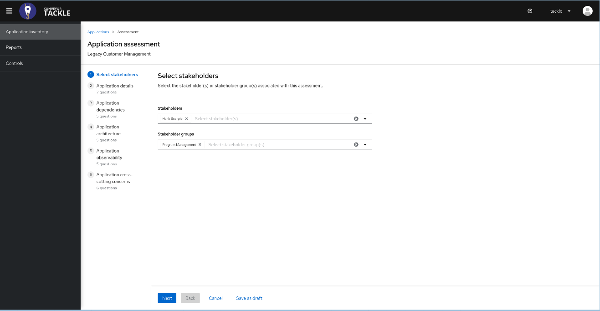
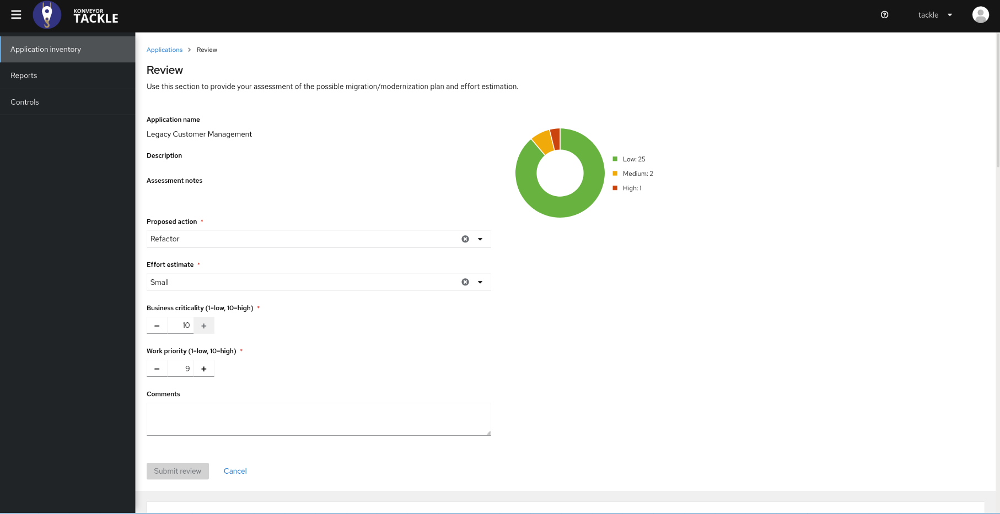

# Assessment

To start the assessment of these applications we will use the Tackle Application Assessment tool.

The idea behind the application inventory is to allow organizations to have a holistic view of their application portfolio and serve as the main integration point for all the Tackle tools like the assessment and analysis.  

Open the Application Inventory UI using the following url (LINK).  You'll notice we've already loaded the existing application portfolio on the App inventory.

## Classification

Applications can be classified and grouped in multiple ways, for example using the business service. Let's focus on the Retail applications now.

***Click on "Filter by business service and enter "Retail"***

One of the key features of the App Inventory is the extensible tagging model that allows to classify applications in multiple dimensions.

Let's focus on the legacy application.  We have added tags that represent its technology, like java, Tomcat and Oracle, and decided to add a custom tag type that allows us to identify which custom architecture libraries are used by each application.  

***Expand the legacy customers application.***

Since the legacy application comes from a traditional platform and we are aware about some problems with the configuration model, let's focus on this one for the assessment.

To start the assessment, select the legacy customer application and click on "Assess".

First step will be to enter the different stakeholders involved with the assessment.

***Once you're happy with the stakeholders, click on "Next".***

The assessment is driven by a questionnaire, and aims to determine the suitability for containerization for a given application.  It covers all the different areas of the application landscape, including the technology, application lifecycle mananagement, and operations.  

These questions allow the tool to identify potential risks that might prevent the application from running in containers or would require any kind of adjustmanr for that. 

***Complete the application details questions and click on "Next"***

You will be presented with the review screen.

The review screen allows you to find out which risks were identified during the assessment and decide which migration strategy to follow based on that.

***Scroll down the screen to view the risks.***

This legacy application use a discovery mechanism that is not cloud friendly, which makes sense since it comes from a classic platform and accesses a database though a static IP.

***Sort the risks, highest first***

Now that we know there will be some changes required in the source code to adapt the application, we can decide that the strategy will be "Refactor"

***Choose "Refractor" as strategy and choose "Small" effort.***

Since this is a key application in the architecture, we're going to set the criticality and priority to "10"

***Set Criticality and Priority to "10"***

Now that we've completed the initial assessment we can see that we will need to dig deeper into the legacy customers application to check what the problem is with the config library and how to remove it.  To do this we will use the analysis module of Tacke.

Next [Step 3](./3-analyze.md)