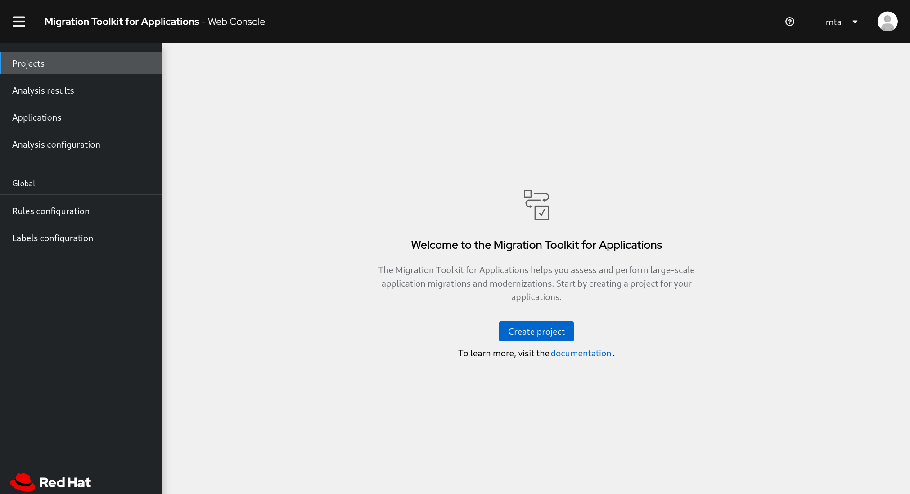

== Analyze application code

To perform an analysis of the application code, we will use the Tackle
Application Assessment tool

To start the analysis tool, click on the following [LINK]

*_Click on create project and enter a project name as shown below_*

image::../images/create-project.png[Create project]

*_Click on ``Next''_*

From the ``Add applications'' page, click on browse to select the WAR
file for analysis, the file is located in the TODO folder

image::../images/add-applications.png[Add applications]

*_Click on ``Next''_*

You will now be presented with options for transformation targets.

image::../images/configure-analysis.png[Configure Analysis]

As this is a tomcat application, we’re going to uncheck the EAP
migration path

*_Uncheck the EAP migration path_*

We will focus on containerizing the application. Since this is going to
be a linux container, it makes sense to do a sanity check to avoid and
Windows paths might remain in the code from previous iterations. We also
going to investigate removing reliance on proprietary JDK licenses, so
we going to select OpenJDK as a target.

*_Check Containers, Linux, and OpenJDK as the targets_*

Next link:./4-refactor.md[Step 4]
