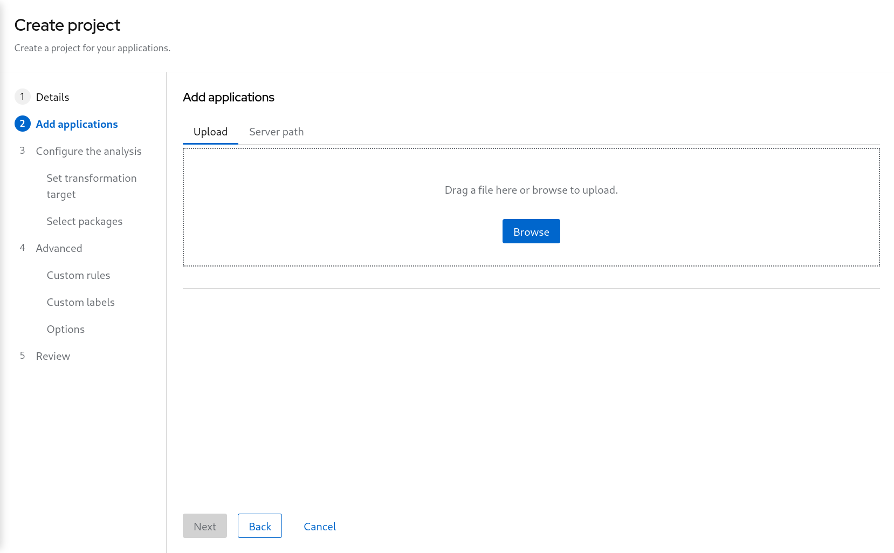

# Analyze application code

To perform an analysis of the application code, we will use the Tackle Application Assessment tool

To start the analysis tool, click on the following [LINK]

***Click on create project and enter a project name as shown below***

***Click on "Next"***

From the "Add applications" page, click on browse to select the WAR file for analysis, the file is located in the TODO folder

***Click on "Next"***

You will now be presented with options for transformation targets.

As this is a tomcat application, we're going to uncheck the EAP migration path

***Uncheck the EAP migration path***

We will focus on containerizing the application.  Since this is going to be a linux container, it makes sense to do a sanity check to avoid and Windows paths might remain in the code from previous iterations.  We also going to investigate removing reliance on proprietary JDK licenses, so we going to select OpenJDK as a target.

***Check Containers, Linux, and OpenJDK as the targets***

Next [Step 4](./4-refactor.md)